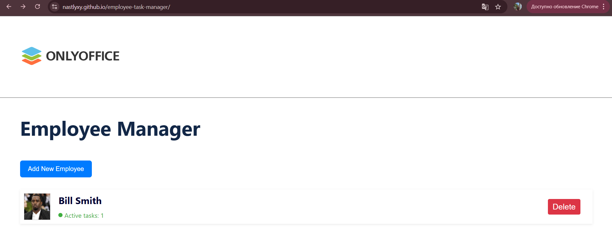

# Employee Task Manager

**Employee Task Manager** is a web application for managing employees and their tasks.  
Built with **React** using modern hooks (`useState`, `useEffect`, `useContext`).

 <!-- You can replace with an actual screenshot -->

---

## Features

- **Add Employees**  
  Fill out a form with: Full Name, Age, Photo, Employment Contract Number.
- **Employee List**  
  Displays employee photo, name, and number of active tasks.
- **Employee Details Page**  
  Shows detailed info: Full Name, Age, Contract Number, and a larger photo.
- **Task Management**  
  - Add new task with deadline  
  - Delete task  
  - Mark task as completed
- **Live UI Updates** (no page reloads)

---

## 🛠️ Tech Stack

- **React 18** (hooks: `useState`, `useEffect`, `useContext`)
- **CSS Modules / Flexbox** for styling
- **JavaScript (ES6+)**
- **gh-pages** for deployment

Developer: @nastlyxy
Year: 2025